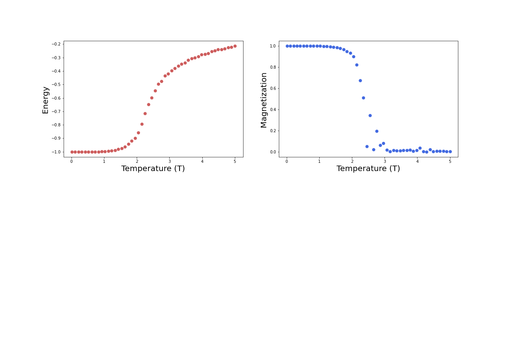
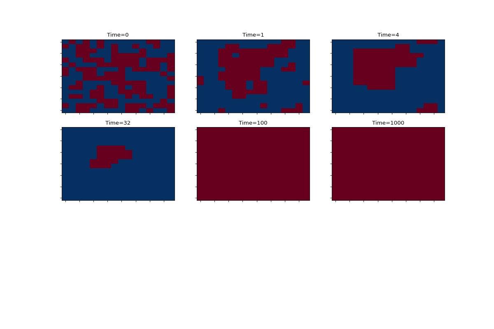

# 2D Ising model

The Ising Hamiltonian can be written as, 

- The spins ***Si*** can take values ±1,  
- ***⟨ij⟩*** implies nearest-neighbor interaction only,  
- ***J***>0 is the strength of exchange interaction.  

The system undergoes a 2nd order phase transition at the critical temperature ***Tc***. For temperatures less than ***Tc***, the system magnetizes, and the state is called the ferromagnetic or the ordered state. This amounts to a globally ordered state due to the presence of local interactions between the spin. For temperatures greater than ***Tc***, the system is in the disordered or the paramagnetic state. In this case, there are no long-range correlations between the spins.  

The order parameter 

 

for this system is the average magnetization. The order parameter distinguishes the two phases realized by the systems. It is zero in the disordered state, while non-zero in the ordered, ferromagnetic, state.
The one dimensional (1D) Ising model does not exhibit the phenomenon of phase transition while higher dimension do; this can be argued based on arguments related to the change in free energy 

 Here ***E*** and ***S*** are, respectively, the energy and entropy of the system. We estimate the net change in free energy for introducing a disorder in an otherwise ordered system. The ordered state can only be stable if the net change in free energy is positive, ***ΔF>0***, for any non-zero temperature.

In this project we will simulate the ***2D*** Ising model using a Monte-Carlo simulation.

## Monte-Carlo simulation of 2D Ising model

The following code simulates the Ising model in 2D using the Metropolis algorithm. The main steps of Metropolis algorithm are:

1. Prepare an initial configuration of ***N*** spins  
2. Flip the spin of a randomly chosen lattice site.  
3. Calculate the change in energy ***dE***.  
4. If ***dE < 0***, accept the move. Otherwise accept the move with probability ***exp^{-dE/T}***. This satisfies the detailed balance condition, ensuring a final equilibrium state.  

Repeat 2-4. 

For references about Metropolis algorithm, see [this link](https://www.asc.ohio-state.edu/braaten.1/statphys/Ising_MatLab.pdf).

## Structure of the project
These are the steps in order to start the program and to plot the results:
1) First, the user has to choose between the different configurations of the lattice (in our case there is only one, configuration.txt) and eventually write a new one, using the syntax of [configuration](https://github.com/JonathanFrassineti/Software-Project/blob/master/configuration.txt); if the user wants to do so,
he has to specify the lattice parameters (N, M, numberTemp, startTemo, endTemp and eqSteps) and also the local paths to the folders where data and graphs must be saved.
2) Then, to start the Ising model the user has to launch the file [simulation](https://github.com/JonathanFrassineti/Software-Project/blob/master/simulation.py) which imports its parameters from [configuration](https://github.com/JonathanFrassineti/Software-Project/blob/master/configuration.txt) using ConfigParser library; there could be different types of configurations for the model, depending on the size of the lattice, the MonteCarlo steps or the folder where data are saved, so the user has to specify the configuration he wants when launching the simulation file from the command line with the syntax ***"python simulation.py name_of_the_configuration"*** (in our case, configuration.txt).
The collected data (time evolution, energy and magnetization) are saved automatically in the ***data*** folder using their local paths.
3) At the end, the user has to launch the [plots](https://github.com/JonathanFrassineti/Software-Project/blob/master/plots.py) file with the configuration he wants; from command line, the syntax is  ***"python plots.py name_of_the_configuration"*** (in our case, configuration.txt). 
The data are loaded from the configuration file through their local paths and then they are saved in the ***images*** folder automatically.

This is how I divided my project into blocks:

- In the file [ising](https://github.com/JonathanFrassineti/Software-Project/blob/master/ising.py) I have built the Ising functions that calculate energy and magnetization of the system, and save them in arrays in order to use them for further data analysis. In addition, for a given temperature there is a function that calculates the different states of a lattice during time, from disordered state to ordered state.  

- In the file [testing](https://github.com/JonathanFrassineti/Software-Project/blob/master/testing.py) I have tested all the Ising functions to ensure that all of them work properly, using hypothesis testing.

- In the file [configuration](https://github.com/JonathanFrassineti/Software-Project/blob/master/configuration.txt) there are all the definitions of the parameters used in the simulation file, as number of spins per lattice (N*M), temperature intervals and so on. Furthermore, there are the local paths in order to load the array data and to save them as images and graphs. It's a .txt file that is imported in simulation file.

- In the file [simulation](https://github.com/JonathanFrassineti/Software-Project/blob/master/simulation.py) there is the main part of the code, where I have used the functions of ising file in order to calculate the energy and the magnetization of a configuration of spins for a range of temperatures across the critical one ***Tc***, showing a steeply decrease in energy from high temperatures to low ones and a rapidly increase in magnetization, a clear sign of a phase transition. In addition there is the calculation of the different states of the configuration of spins for a given temperatrue, lower than ***Tc***, respect to time, which shows that the system coarsens toward the configuration of all spins aligned; then I saved these states in an array to process them in further data analysis.
Here I used the ConfigParser library in order to import the configuration file from command line, and passing its parameters to the program.

- In file [plots](https://github.com/JonathanFrassineti/Software-Project/blob/master/plots.py) there are the two functions that respectively plot the time evolution of the system and the energy and the magnetization, loading the data from the saved arrays from command line.

To show you some results:
1) this is the plot of energy vs T and magnetization vs T.

2) and this is how the simulation of a given configuration looks like, for a given temperature and during the time: 

