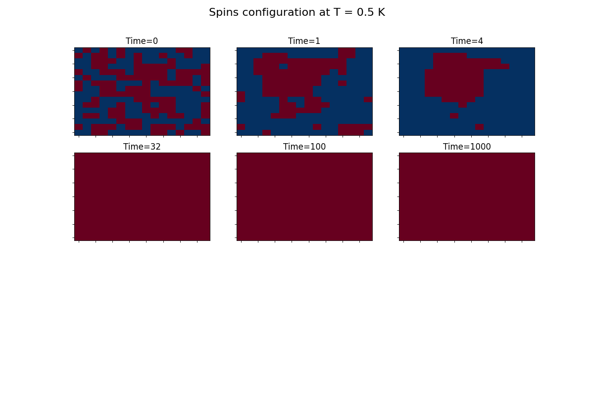

# 2D Ising model

The Ising Hamiltonian can be written as, 

- The spins ***Si*** can take values ±1,  
- ***⟨ij⟩*** implies nearest-neighbor interaction only,  
- ***J***>0 is the strength of exchange interaction.  

The system undergoes a 2nd order phase transition at the critical temperature ***Tc***. For temperatures less than ***Tc***, the system magnetizes, and the state is called the ferromagnetic or the ordered state. This amounts to a globally ordered state due to the presence of local interactions between the spin. For temperatures greater than ***Tc***, the system is in the disordered or the paramagnetic state. In this case, there are no long-range correlations between the spins.  

The order parameter 

 

for this system is the average magnetization. The order parameter distinguishes the two phases realized by the systems. It is zero in the disordered state, while non-zero in the ordered, ferromagnetic, state.
The one dimensional (1D) Ising model does not exhibit the phenomenon of phase transition while higher dimension do; this can be argued based on arguments related to the change in free energy 

 Here ***E*** and ***S*** are, respectively, the energy and entropy of the system. We estimate the net change in free energy for introducing a disorder in an otherwise ordered system. The ordered state can only be stable if the net change in free energy is positive, ***ΔF>0***, for any non-zero temperature.

In this project we will simulate the ***2D*** Ising model using a Monte-Carlo simulation.

## Monte-Carlo simulation of 2D Ising model

The following code simulates the Ising model in 2D using the Metropolis algorithm. The main steps of Metropolis algorithm are:

1. Prepare an initial configuration of ***N*** spins  
2. Flip the spin of a randomly chosen lattice site.  
3. Calculate the change in energy ***dE***.  
4. If ***dE < 0***, accept the move. Otherwise accept the move with probability ***exp^{-dE/T}***. This satisfies the detailed balance condition, ensuring a final equilibrium state.  

Repeat 2-4. 

For references about Metropolis algorithm, see [this link](https://www.asc.ohio-state.edu/braaten.1/statphys/Ising_MatLab.pdf).

## Structure of the project
In order to start the Ising model, the user has to launch the file [simulation](https://github.com/JonathanFrassineti/Software-Project/blob/master/simulation.py) which imports its parameters from [configuration](https://github.com/JonathanFrassineti/Software-Project/blob/master/configuration.py); there could be different types of configurations for the model, so the user has to specify the configuration he wants when launching the simulation file.

This is how I divided my project into blocks:

- In the file [ising](https://github.com/JonathanFrassineti/Software-Project/blob/master/ising.py) I have built the Ising functions that calculate energy and magnetization of the system, and save them in arrays in order to use them for further data analysis. In addition, for a given temperature there is a function that calculates the different states of a lattice during time, from disordered state to ordered state.  

- In the file [testing](https://github.com/JonathanFrassineti/Software-Project/blob/master/testing.py) I have tested all the Ising functions to ensure that all of them work properly, using hypothesis testing.

- In the file [configuration](https://github.com/JonathanFrassineti/Software-Project/blob/master/configuration.py) there are all the definitions of the parameters used in the simulation file, as number of spins per lattice (N*M), temperature intervals and so on. I used the library ConfigParser in order to allow my program to use different types of configurations.

- In the file [simulation](https://github.com/JonathanFrassineti/Software-Project/blob/master/simulation.py) there is the main part of the code, where I have used the functions of ising file in order to calculate the energy and the magnetization of a configuration of spins for a range of temperatures across the critical one ***Tc***, showing a steeply decrease in energy from high temperatures to low ones and a rapidly increase in magnetization, a clear sign of a phase transition. In addition there is the calculation of the different states of the configuration of spins for a given temperatrue, lower than ***Tc***, respect to time, which shows that the system coarsens toward the configuration of all spins aligned; then I saved these states in an array to process them in further data analysis.

- In file [plots](https://github.com/JonathanFrassineti/Software-Project/blob/master/plots.py) there are the two functions that respectively plot energy and magnetization and the time evolution of the system, loading the data from the saved arrays.

To show you some results, this is how the simulation of a given configuration looks like, for a given temperature and during the time: 

